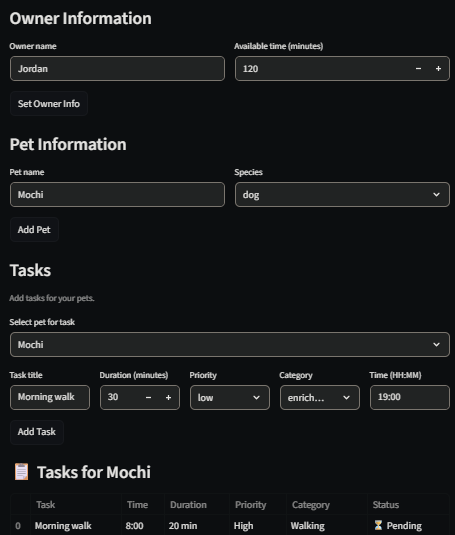

# PawPal+ (Module 2 Project)

You are building **PawPal+**, a Streamlit app that helps a pet owner plan care tasks for their pet.

## Scenario

A busy pet owner needs help staying consistent with pet care. They want an assistant that can:

- Track pet care tasks (walks, feeding, meds, enrichment, grooming, etc.)
- Consider constraints (time available, priority, owner preferences)
- Produce a daily plan and explain why it chose that plan

Your job is to design the system first (UML), then implement the logic in Python, then connect it to the Streamlit UI.

## What you will build

Your final app should:

- Let a user enter basic owner + pet info
- Let a user add/edit tasks (duration + priority at minimum)
- Generate a daily schedule/plan based on constraints and priorities
- Display the plan clearly (and ideally explain the reasoning)
- Include tests for the most important scheduling behaviors

## Smarter Scheduling

PawPal now includes features to help owners manage their pets tasks more efficiently.

Task Completion & Recurrence — Mark tasks as complete and automatically generate follow-up tasks for recurring tasks.

Task Filtering — Filter tasks by completion status or by a specific pet.

Time-Based Sorting — Tasks are sorted by their scheduled time of day and will appear in chronological order.

Conflict Detection — When two or more tasks are scheduled at the same time, users will receive a warning so they can resolve them before the day begins.

## Testing PawPal+

Use the following command to run the tests:

```bash
python -m pytest
```

### What the tests cover

- **Task Completion** — Verifies that marking a task as complete correctly updates its status.

- **Pet Task Management** — Confirms that adding a task to a pet increases the task count as expected.

- **Sorting Correctness** — Ensures tasks are returned in chronological order by time of day, and that tasks without a scheduled time are placed at the end.

- **Recurrence Logic** — Confirms that completing a daily or weekly task automatically generates a follow-up task with the correct next due date. Also verifies that non-recurring tasks return no follow-up task.

- **Conflict Detection** — Verifies that the Scheduler flags tasks scheduled at the same time, both within a single pet and across multiple pets.

- **Confindence Level** — ⭐⭐⭐⭐⭐

## Features

### Owner & Pet Management
- **Owner Setup** — Enter an owner's name and available time in minutes to set up a personalized planning session.
- **Multi-Pet Support** — Add multiple pets per owner, each with their own independent task list.

### Task Management
- **Task Creation** — Add tasks with a title, duration, priority, category, and optional scheduled time.
- **Priority Levels** — Tasks are ranked by priority (high, medium, low) to ensure the most important care happens first.
- **Task Categories** — Organize tasks by type: walking, feeding, meds, grooming, enrichment, or general.

### Scheduling Algorithms
- **Priority-Based Scheduling** — When generating a daily plan, tasks are sorted by priority (highest first) and then by duration (shortest first) to maximize what fits within the owner's available time.
- **Time-Based Sorting** — Tasks with a scheduled time are displayed in chronological order. Tasks without a time are placed at the end of the list.
- **Conflict Detection** — The scheduler scans all tasks and flags any two or more tasks scheduled at the same time, including conflicts across multiple pets.
- **Daily & Weekly Recurrence** — Marking a recurring task as complete automatically generates a follow-up task for the next due date.
- **Time Fit Validation** — Tasks that exceed the owner's remaining available time are skipped and flagged with an explanation.

### Filtering & Display
- **Task Filtering** — Filter tasks by completion status (pending or completed) and by pet name to quickly find what needs attention.
- **Plan Explanation** — Each generated schedule includes a reasoning section explaining why each task was included or skipped.
- **Conflict Warnings** — Live conflict alerts appear in the UI using visual warnings so owners can resolve scheduling issues before the day begins.

## 📸 Demo Section

<a href="pawpal_screenshot.png" target="_blank"></a>

## Getting started

### Setup

```bash
python -m venv .venv
source .venv/bin/activate  # Windows: .venv\Scripts\activate
pip install -r requirements.txt
```

### Suggested workflow

1. Read the scenario carefully and identify requirements and edge cases.
2. Draft a UML diagram (classes, attributes, methods, relationships).
3. Convert UML into Python class stubs (no logic yet).
4. Implement scheduling logic in small increments.
5. Add tests to verify key behaviors.
6. Connect your logic to the Streamlit UI in `app.py`.
7. Refine UML so it matches what you actually built.
